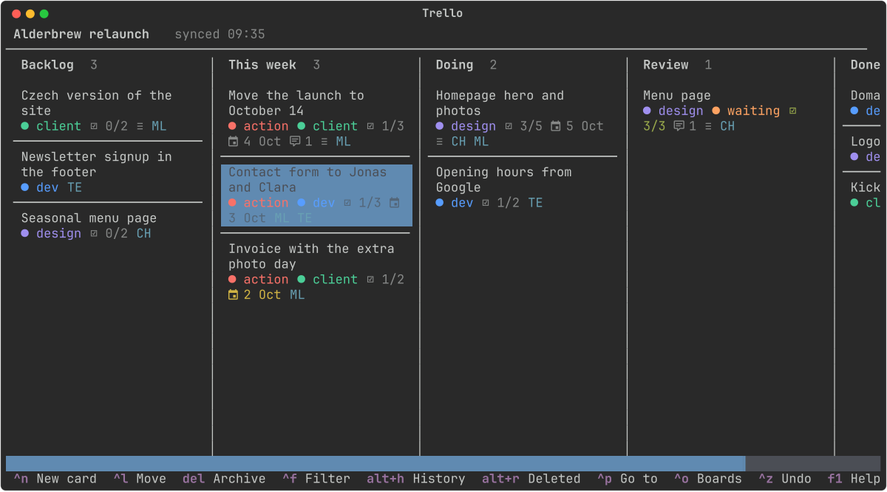

# Trello for Omarchy

A fast terminal Trello client for [Omarchy](https://omarchy.org). Arrow keys and Ctrl shortcuts
(no vim), `Ctrl+P` to jump to any card on any board, and a **history that remembers everything**:
delete a checklist by accident in Trello and its items are gone for good. Here you get them back.



## Why it's fast

Everything is painted from a local copy at once. Every change shows on screen first and goes to
Trello behind it, in order, so you never wait for the network. Searching (`Ctrl+P` across all boards,
`Ctrl+F` within one) never leaves your machine, and it ignores accents (`spindl` finds *Špindl*).

## History

Every card, list, checklist, check item, label and comment is versioned in a local SQLite
database (`~/.local/share/petrzpav-trello/history.db`). The history is recorded:

- when the app syncs a board,
- when the app itself changes something (the moment Trello confirms it),
- every 5 minutes by `trello-snapshot.timer`, so changes made in the browser or by
  teammates are caught too.

`Alt+H` shows the history of a card (or of the board) and `Alt+R` lists what was deleted. Enter on an
event shows the before/after and puts it back. A deleted checklist comes back with all its items
and their ticks, and a deleted card with its checklists and comments. `Ctrl+Z` undoes your own
changes, again and again.

## My actions

`Alt+A` lists your open cards labelled **action**, from every board, with the next three open
checklist items of each. Overdue and due cards come first, then the most recently active ones.
`Space` ticks an item and the next one moves up, `→` shows all of a card's items (and `←` fewer,
then none), and `Enter` opens the card. The label, the member (you by default) and the number of
items per card are set in `config.toml`:

```toml
actions_label = "action"
actions_member = ""    # username, full name or initials; empty = you
actions_items = 3
```

## Keys

| Key | |
|---|---|
| `← → ↑ ↓`, `Enter` | move between lists and cards, open a card |
| `Shift+← →`, `Shift+↑ ↓` | move the card to the next list / up and down (items too, in a card) |
| `Ctrl+P` | go to any card or board; `>` for commands |
| `Ctrl+O` | switch board |
| `Ctrl+F`, `Esc` | filter cards (name, description, labels, members, checklists, comments) |
| `Ctrl+N`, `Alt+N` | new card (in a card: new item, then the next one…), new checklist |
| `F2` / `Enter` | rename / edit what's under the cursor |
| `Space` | tick an item |
| `← →` | in a card, on a checklist heading: fold / unfold it |
| `Alt+C` | hide / show completed checklist items (remembered) |
| `Ctrl+L`, `Alt+L`, `Alt+M`, `Alt+D` | move to list (also on another board), labels, members, due date |
| `Ctrl+R` | comment |
| `Delete` | archive the card; in a card, delete the item / checklist / comment |
| `Ctrl+Z` | undo |
| `Alt+H`, `Alt+R` | history, recently deleted |
| `Alt+O` | open in the browser |
| `Alt+Y` | copy the link of the card (or the board) |
| `Alt+A` | my actions: “action” cards I'm on, from every board |
| `F5`, `F1`, `Ctrl+Q` | refresh, help, quit |

Every key can be changed in `~/.config/petrzpav-trello/config.toml` under `[keys]`.

## Install

```
omarchy plugin add https://github.com/petrzpav/omarchy-trello --enable
~/.config/omarchy/plugins/petrzpav.trello/install.sh
trello auth
systemctl --user enable --now trello-snapshot.timer
```

`trello auth` asks for an API key. Get one at <https://trello.com/power-ups/admin>: create a
Power-Up (no capabilities, no iframe URL), open **Trello Auth**, generate an API key, and then
allow the token in the browser window it opens. You need [uv](https://docs.astral.sh/uv/);
Python and the dependencies are set up on first run.

## Remove

```
~/.config/omarchy/plugins/petrzpav.trello/install.sh --remove   # timer, ~/.local/bin links
omarchy plugin remove petrzpav.trello
rm -rf ~/.config/petrzpav-trello ~/.local/share/petrzpav-trello   # optional: config, key, history
```

`install.sh` only removes what it made: links it didn't create are left alone. The app talks to
`api.trello.com` only, with your own key and token (kept in `~/.config/petrzpav-trello/secrets`,
chmod 600).
